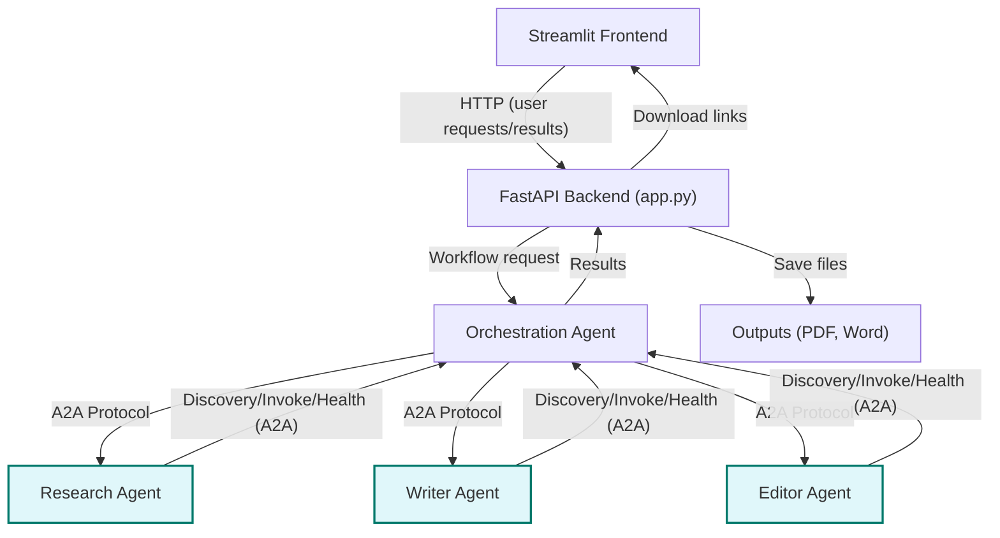

# AI Agent-to-Agent Protocol Content Suite

## Table of Contents
- [Overview](#overview)
- [Architecture Diagram](#architecture-diagram)
- [System Components](#system-components)
- [Agent-to-Agent Protocol](#agent-to-agent-protocol)
- [Workflows Supported](#workflows-supported)
- [Setup & Running](#setup--running)
- [API Endpoints](#api-endpoints)
- [Extending the System](#extending-the-system)
- [Troubleshooting](#troubleshooting)
- [License](#license)

---

## Overview

This project is a modular, multi-agent system for automated research, writing, and editing, orchestrated via a custom Agent-to-Agent (A2A) protocol. Each agent is specialized and independently deployable, communicating through a standardized protocol. The system is orchestrated by a central agent and exposed via a modern Streamlit frontend.

---

## Architecture Diagram




---

## System Components

### 1. **Streamlit Frontend**
- User interface for workflow selection, content input, and result visualization.
- Connects to the backend via HTTP.

### 2. **FastAPI Backend (`app.py`)**
- Exposes endpoints for each workflow.
- Handles CORS for frontend communication.
- Serves downloadable outputs.

### 3. **Orchestration Agent**
- Receives user requests, determines workflow, and coordinates agent interactions.
- Implements workflow logic (Research Only, Edit Only, Write with Research, Full Workflow, Structure/Clean).

### 4. **Research Agent**
- Conducts comprehensive research, trend analysis, and can structure/clean user-provided research.
- Uses Google Gemini LLM.

### 5. **Writer Agent**
- Generates articles and marketing copy, leveraging research data.
- Uses Google Gemini LLM.

### 6. **Editor Agent**
- Performs advanced editing, proofreading, and content enhancement.
- Uses Google Gemini LLM.

### 7. **Outputs Directory**
- Stores generated PDF and Word files for download.

---

## Agent-to-Agent Protocol

- **Standardized Communication**: All agents use the Google A2A v1 protocol.
- **Endpoints**:
  - `/a2a/discovery`: Capability discovery.
  - `/a2a/invoke`: Capability invocation.
  - `/a2a/health`: Health check.
- **Capabilities**: Each agent registers its skills with input/output schemas, enabling dynamic orchestration.

---

## Workflows Supported

- **Research Only**: Research Agent generates a structured report.
- **Edit Only**: Editor Agent enhances user-provided content.
- **Write (with Research)**: Writer Agent creates content based on fresh research.
- **Full Workflow**: Research → Write → Edit, with export to PDF/Word.
- **Structure/Clean Research**: Research Agent structures/cleans uploaded or pasted research.

---

## Setup & Running

### Prerequisites
- Python 3.12+
- [Google Gemini API key](https://ai.google.dev/)
- macOS (for the provided shell script)

### Installation

1. **Clone the repository** and navigate to the project root.

2. **Create and activate a virtual environment**:
   ```bash
   python3 -m venv venv
   source venv/bin/activate
   ```

3. **Install dependencies**:
   ```bash
   pip install -r requirements.txt
   ```

4. **Set up environment variables**:
   - Create a `.env` file in the root directory.
   - Add your Google Gemini API key:
     ```
     GOOGLE_API_KEY=your_api_key_here
     ```

5. **Start all agents and the API server**:
   ```bash
   bash start_all_agents.sh
   ```
   This opens new Terminal tabs for each agent and the API server.

6. **Run the Streamlit frontend**:
   ```bash
   streamlit run streamlit_app.py
   ```
   Access the UI at [http://localhost:8501](http://localhost:8501).

---

## API Endpoints

- `/research` — Research Only
- `/edit` — Edit Only
- `/write` — Write (with Research)
- `/full_workflow` — Full Workflow
- `/structure_research` — Structure/Clean Research

---

## Extending the System

- **Add new agent capabilities** by registering new skills in the agent's `_register_capabilities` method.
- **Add new workflows** by extending the Orchestration Agent and exposing new endpoints in `app.py`.
- **Integrate new LLMs** by updating the agent's model initialization.

---

## Troubleshooting

- **Agents not responding**: Ensure all agents are running (check Terminal tabs).
- **API key issues**: Verify your `.env` file and that the key is valid.
- **Frontend not connecting**: Ensure CORS is enabled and all services are running on the correct ports.

---

## License

This project is for internal research and demonstration purposes.
